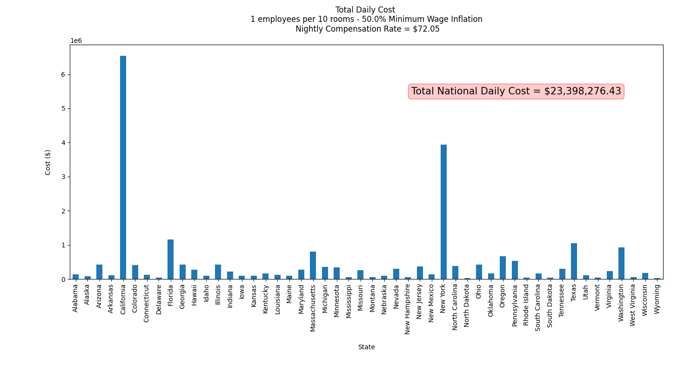

# Sheltering the Homeless During a Pandemic

## Introduction

Althought the COVID-19 has caused significant changes in almost every American's daily life, one of the populations
that seems to be ignored is the homeless population. We fail to realize the impact that this population can
have on the virus' spread. In San Fransico, out of about 800 known cases in the city, 68 have been reported to be 
amongst the homeless population ()almost 10 percent of all cases). Dr. Katie Brooks from the San Francisco General 
Hospital stated “I am having a really tough time discharging people from the hospital to anywhere but to the street"(Bond). 
In order to ease the spread of the virus and also care for a population that is need of help, we must find alternate 
solutions during this pandemic. Jack Chase, a family medicine doctor and leader of the hospital’s social medicine team
in San Fransico, stated “This pandemic, like any crisis, is unmasking the preexisting vulnerabilities in the system by 
placing greater pressure on an already stressed system. We have to invest in the care and social needs for both the 
vulnerable people and everybody else. It benefits everybody to care for the most vulnerable” (Bond).

To combat this issue, "authorities in Las Vegas needed to find additional sleeping space for the city’s sizable homeless 
population when a 500-bed overnight shelter closed after a client tested positive for the new coronavirus. Officials 
turned a parking lot into a makeshift shelter, saying spaces for sleeping were drawn 6ft apart in observance of federal 
social distancing guidelines" (Koran).

This action sparked a lot of commentary amongst the general population. Julián Castro, Mayor of San Antonio, tweeted: 
"There are 150K hotel rooms in Vegas going unused right now. How about public-private cooperation (resources) to 
temporarily house them there? And fund permanent housing!"

Castro's tweet sparks up the question if it is possible to house the homeless in the empty rooms caused by the COVID-19. 

This project will work to answer this overarching question:

1. Is it feasible to house the entire homeless population in hotel rooms during this pandemic? And if so, how many rooms 
would be needed?

2. What would be the cost of sheltering the homeless population in hotel room? Could the government fund this transfer
through another stimulus bill?

## Data Collection

The two obvious data sets that were going to be needed were hotel data specific to each state and homeless population 
data. The American Hotel & Lodging Association website provided the desired data about hotels. In order to extract these
features a self-made scraper was used to get information on the number of hotels, rooms available, and jobs provided by 
the hotel industry in a specific state. Next, data provided by the United States Interagency Council on Homelessness
was used to extract the data needed for the other half of this project. Although many features detailing the homeless 
population were extracted using another self-made scraper, the main statistic that was used in this project was the total 
homeless population for each state.

Finally, a data set mapping each state to its minimum wage was found in order to perform more accurate estimations
on the economic feasibility this transfer.

## Process, Reasoning, and Results

The first step to take using the extracted data was to answer the first question: Is it feasible to house the entire 
homeless population in hotel rooms during this pandemic. And if so , how many rooms would be needed? The following 
figure illustrates the percent of the total rooms the homeless population would occupy assuming that each room is filled
with 2 people.

From this graphic, we can see that California, Massachusets, New York, Oregon, and Washington would be the states that
would need to allocate the most amount of rooms out of all 50 states. However, it is important to note that even with 
these states, the maximum percentage of the rooms occupied is still less than 20%.

---

The first cost consideration for each hotel would be the number of employees required to take care of the new
guests. This cost for each state is dependent on the number of rooms required for each state which is calculated using
the percent composition found in the first step. Other significant factors (and selected values in parenthesis) that 
were taken into consideration included the following:
1. The number of guests per room (2)
2. The number of employees needed per 10 rooms (1)
3. The minimum hourly wage for each state and a percentage to increase it by for working during these times (10%)
4. The typical number of work hours for a hotel employee (8)

With these values, the following table lays out the employee cost for each state.

---

The second monetary value that was considered was the revenue each hotel would typically be making for having guests in 
each of these rooms. The hotels should be compensated for giving out these rooms. In order to calcucate the compensation
value, the average nightly hotel rate in the US was used ($180.12). Each hotel would be given 40% of this national
average ($72.05) for every room given to the homeless each night. The compensation amounts for each state is detailed in
the following table:

---

All of this analyis so far leads to one table that sums it all for daily cost. This table shows the total daily cost for each state and
all of its contributing factors.

***

We can now analyze the cost for different durations. The following table illustrates the total cost for each state
as well as the national cost for sheltering the homeless in hotel up to 60 days (dates may not be up to date, however 
total costs are constant).

## Conclusion
As we all know, "congressional leaders have struck a broad compromise on a third stimulus package that could reach $2 
trillion and include relief for major industries such as airlines, small businesses that have seen revenues dwindle or 
disappear, and workers facing layoffs and loss of health coverage" (Zarracina). In comparison, with the costs calculated
in the project, the total cost to shelter the entire US homeless population in hotel rooms around the nation for 60
days would be a little over 1.3 billion. This is only 0.065% of the proposed stimulus bill. This is such a small 
percentage that it could simply be added on to shelter the homeless population during this pandemic. 

## Sources

Bond, Allison. “As Covid-19 Surges among Homeless, Doctors Face Difficult Choices.” STAT, 11 Apr. 2020, 
www.statnews.com/2020/04/11/coronavirus-san-francisco-homeless-doctors-difficult-choices/.

Koran, Mario. “Las Vegas Parking Lot Turned into 'Homeless Shelter' with Social Distancing Markers.” 
The Guardian, Guardian News and Media, 31 Mar. 2020, www.theguardian.com/us-news/2020/mar/30/las-vegas-parking-lot-homeless-shelter.

Zarracina, Javier, et al. “Congress' $2 Trillion Coronavirus Stimulus Package, Visualized.” USA Today, 
Gannett Satellite Information Network, 25 Mar. 2020, 
www.usatoday.com/in-depth/news/2020/03/23/congress-stimulus-packages-coronavirus-graphics/2890864001/.