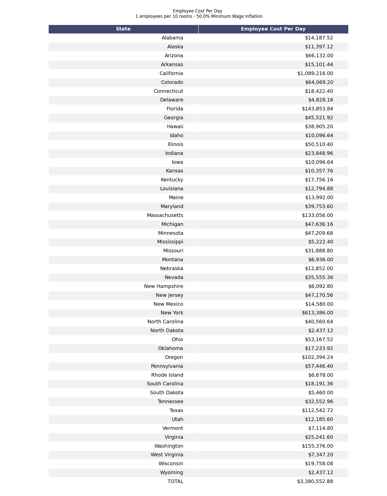
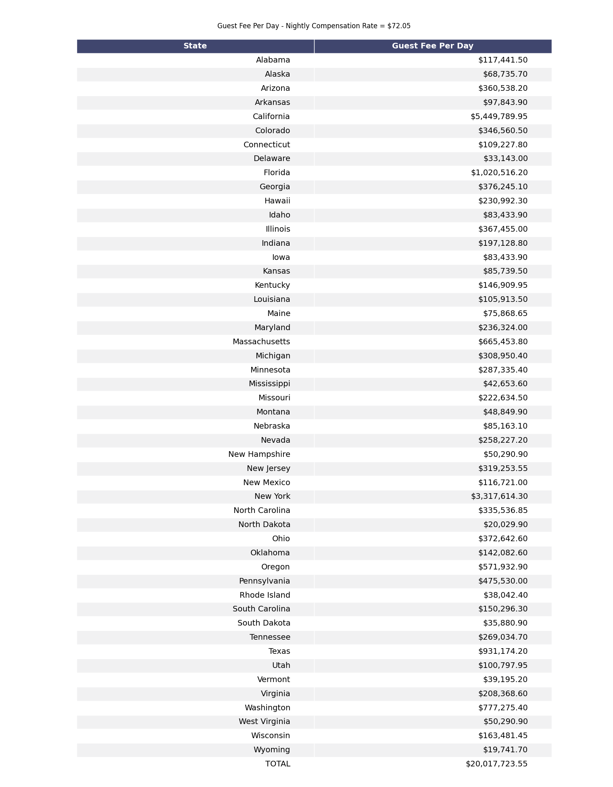
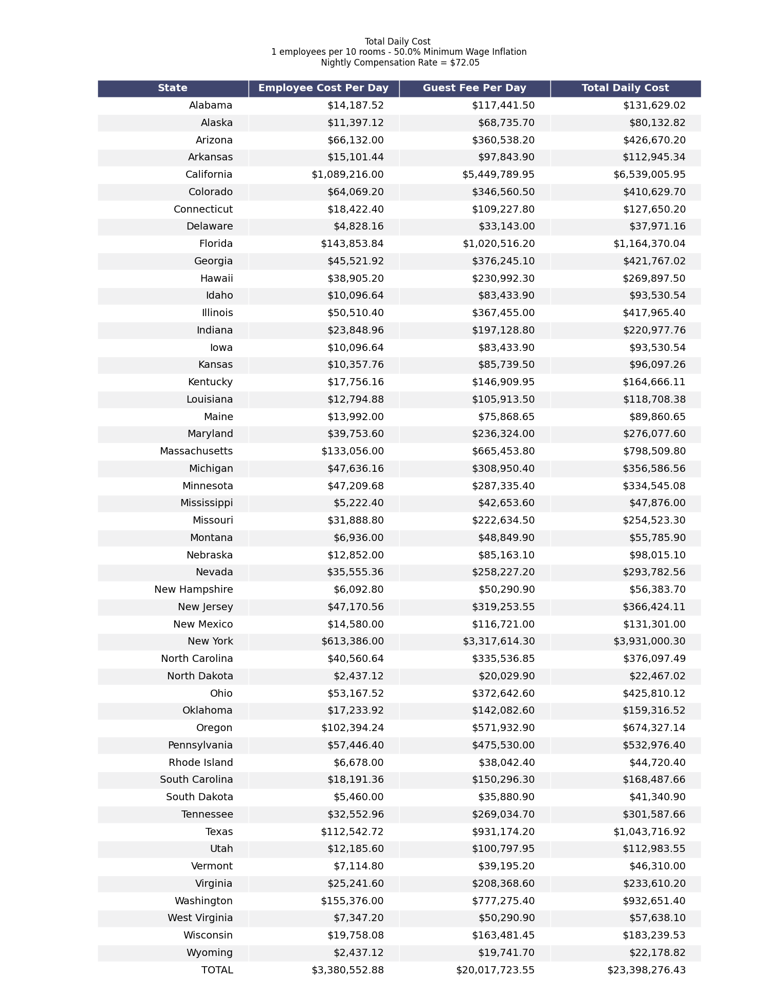

# Sheltering the Homeless During a Pandemic

## Introduction

Although the COVID-19 has caused significant changes in every American's daily life, one of the populations that has been the most  ignored is the homeless population. We fail to realize the impact that this population can have on the virus' spread.  

In San Francisco, out of about 800 known cases in the city, 68 have been reported to be amongst the homeless population (almost 10 percent of all cases), according to the STAT News Covid-19 Tracker (Bond). Dr. Katie Brooks from the San Francisco General Hospital stated “I am having a really tough time discharging people from the hospital to anywhere but to the street" (Bond). In order to ease the spread of the virus and also care for a population that is in need of help, we must find alternate solutions during this pandemic. Jack Chase, a family medicine doctor and leader of the hospital’s social medicine team in San Francisco, stated “This pandemic, like any crisis, is unmasking the pre existing vulnerabilities in the system by placing greater pressure on an already stressed system. We have to invest in the care and social needs for both the vulnerable people and everybody else. It benefits everybody to care for the most vulnerable” (Bond).  

To combat this issue, "authorities in Las Vegas needed to find additional sleeping space for the city’s sizable homeless population when a 500-bed overnight shelter closed after a client tested positive for the new coronavirus. Officials turned a parking lot into a makeshift shelter, saying spaces for sleeping were drawn 6ft apart in observance of federal social distancing guidelines" (Koran).  

This action sparked a lot of commentary amongst the general population. Julián Castro, Mayor of San Antonio, tweeted: "There are 150K hotel rooms in Vegas going unused right now. How about public-private cooperation (resources) to temporarily house them there? And fund permanent housing!"  

Castro's tweet begs the question if it is possible to house the homeless in the empty rooms caused by the COVID-19.  
 

This project will work to answer this overarching question:

1. Is it feasible to house the entire homeless population in hotel rooms during this pandemic? And if so, how many rooms 
would be needed?

2. What would be the cost of sheltering the homeless population in hotel room? Could the government fund this transfer
through another stimulus bill?

## Data Collection

The two primary data sets that are required are hotel data specific to each state and homeless population 
data. The American Hotel & Lodging Association website provided the desired data about hotels. In order to extract these
features a self-made scraper was used to get information on the number of hotels, rooms available, and jobs provided by 
the hotel industry in a specific state. Next, data provided by the United States Interagency Council on Homelessness
was used to extract the data needed for the other half of this project. Although many features detailing the homeless 
population were extracted using another self-made scraper, the main statistic that was used in this project was the total 
homeless population for each state.

Finally, a data set mapping each state to its minimum wage was found in order to perform more accurate estimations
on the economic feasibility of this transfer.

## Process, Reasoning, and Results
(The following results can be calculated with custom inputs outlined in the [Reproduce Financial Analysis with User Defined Inputs](#reproduce-financial-analysis-with-user-defined-inputs) section) 

The first step to take using the extracted data was to answer the first question: Is it feasible to house the entire 
homeless population in hotel rooms during this pandemic. And if so, how many rooms would be needed? The following 
figure illustrates the percent of the total rooms the homeless population would occupy assuming that each room is filled
with 2 people.

From this graphic, we can see that California, Massachusets, New York, Oregon, and Washington would be the states that
would need to allocate the most amount of rooms out of all 50 states. However, it is important to note that even with 
these states, the maximum percentage of the rooms occupied is still less than 20%.

---

The first cost consideration for each hotel would be the number of employees required to take care of the new
guests. This cost for each state is dependent on the number of rooms required for each state which is calculated using
the percent composition found in the first step. Other significant factors (and selected values in parenthesis) that 
were taken into consideration included the following:
1. The number of guests per room (2)
2. The number of employees needed per 10 rooms (1)
3. The minimum hourly wage for each state and a percentage to increase it by for working during these times (50%) (Based off of HEB and Amazon paying their employees 1.5x their current hourly pay)
4. The typical number of work hours for a hotel employee (8)

With these values, the following table lays out the employee cost for each state.

---

The second monetary value that was considered was the revenue each hotel would typically be making for having guests in 
each of these rooms. The hotels should be compensated for giving out these rooms. In order to calculate the compensation
value, the average nightly hotel rate in the US was used ($180.12). Each hotel would be given 40% of this national
average ($72.05) for every room given to the homeless each night. The compensation amounts for each state is detailed in
the following table:

---

All of this analysis so far leads to one table that sums it all for daily cost. This table shows the total daily cost for each state and
all of its contributing factors.

***

We can now analyze the cost for different durations. The following table illustrates the total cost for each state
as well as the national cost for sheltering the homeless in hotels for up to 60 days (dates may not be up to date, however 
total costs are constant).

## Conclusion

This project sought to answer two questions related to a potential agreement between the public and private sector to house homeless individuals with hotel rooms: how many rooms would be required, and what would that cost would be. Based on available data, states would use between 1% (in the case of Wyoming) and up to 20% (in the case of New York) of all available hotel rooms. Most states would use between 2% and 6% of available hotel rooms, with states with larger homeless populations (California, Oregon, Massachusetts, Washington), using between 10% and 15% of available rooms. This number is significantly less than the available number of hotel rooms, suggesting the logistic feasibility of this measure.  

To determine the estimated cost of providing housing to homeless individuals, the cost for employees and guests were calculated per day, based on number of rooms needed, typical work hours per employee, a 50% raise on minimum wage, and national average cost per hotel room. Using these estimates, the total national daily cost to house all homeless individuals is 22.5 million dollars per day, which would be 1.35 billion dollars for 60 days. While these estimates rely on somewhat conservative measures for employee pay, and the cost of reassigning guest rooms do not reflect statewide and local differences in the granular costs for each hotel room, the total cost to provide housing provides the best estimate given the available data.  

The total cost to house the entire homeless population during this pandemic is thus miniscule compared to the fiscal stimulus packages provided by Congress. Reported in USA Today on March 25, "congressional leaders have struck a broad compromise on a third stimulus package that could reach $2 trillion and include relief for major industries such as airlines, small businesses that have seen revenues dwindle or disappear, and workers facing layoffs and loss of health coverage" (Zarracina). With the costs calculated in the project, the total financial responsibility of sheltering the entire US homeless population in hotel rooms for 60 days would be around 1.4 billion, about 0.07% of the proposed stimulus bill. This cost is small enough that public officials ought to have added this measure for both the epidemiological and humanitarian benefits of slowing the spread of of COVID-19 and reducing the risk to vulnerable populations.  

## Reproduce Financial Analysis with User Defined Inputs
The implemented Command Line Interface will allow users to see the effect or varying the variables used in this project on the total durational cost and percentage of the proposed $2 trillion stimulus package.

Variables to change: number of people kept in a single room, number of employees needed per 10 rooms, and minimum wage inflation percentage.

(Nightly hotel compensation rate and work day hours are kept constant at about $70 per night and 8 hours per day respectively)

<b><u> Instructions: </u></b>

1. From the project home directory run: `pip install -r requirements.txt`

2. From the project home directory run: `python run_this.py national_financial_analysis [people_per_room] [num_employees_per_10_rooms] [min_wage_inflation_percentage] [nightly_compensation]` and replace brackets with values (percentage are kept in decimal form, so 50% would be input as .50)

<i> Example: </i>

Input:  `python run_this.py national_financial_analysis 2 1 0.50 72.02`

Output:  

Assuming hotels house 2 people per room, use 1 employees per 10 rooms used for the homeless, inflate the miniumum wage for thier state by 50.0% for each employee, and are compensated $72.05 per night per room:   

The total duratoinal cost and percent of the passed 2 trillion dollar stimulus bill would be as follows:   

Housing for 1 Night Cost: $23,398,276.43 --> Percentage of stimulus bill 0.0011699138215%  
Housing for 15 Nights Cost: $350,974,146.45 --> Percentage of stimulus bill 0.0175487073225%  
Housing for 30 Nights Cost: $701,948,292.90 --> Percentage of stimulus bill 0.035097414645%  
Housing for 45 Nights Cost: $1,052,922,439.35 --> Percentage of stimulus bill 0.05264612196750001%  
Housing for 60 Nights Cost: $1,403,896,585.80 --> Percentage of stimulus bill 0.07019482929%  

## Sources

Bond, Allison. “As Covid-19 Surges among Homeless, Doctors Face Difficult Choices.” STAT, 11 Apr. 2020, 
www.statnews.com/2020/04/11/coronavirus-san-francisco-homeless-doctors-difficult-choices/.

Koran, Mario. “Las Vegas Parking Lot Turned into 'Homeless Shelter' with Social Distancing Markers.” 
The Guardian, Guardian News and Media, 31 Mar. 2020, www.theguardian.com/us-news/2020/mar/30/las-vegas-parking-lot-homeless-shelter.

Zarracina, Javier, et al. “Congress' $2 Trillion Coronavirus Stimulus Package, Visualized.” USA Today, 
Gannett Satellite Information Network, 25 Mar. 2020, 
www.usatoday.com/in-depth/news/2020/03/23/congress-stimulus-packages-coronavirus-graphics/2890864001/.
